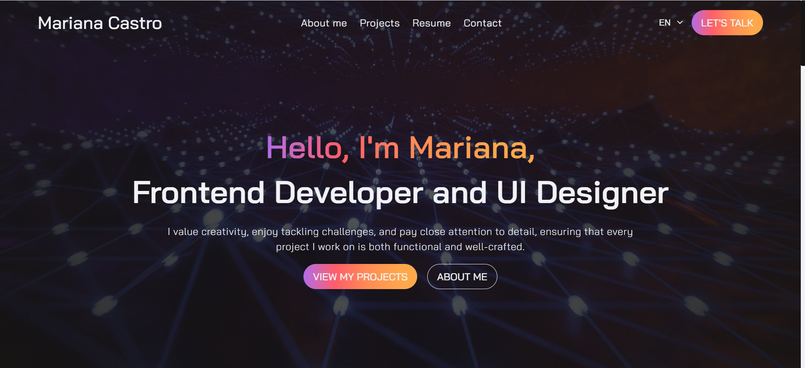

# MarianaCastroPortfolio

<h1 align="center">
    
</h1>

<h4 align="center"> 
	🚧 Mariana Castro - Portfólio 🚧
</h4>

	
	<!--  -->

 <a href="#-sobre-o-projeto">Sobre</a> •
  <a href="#-funcionalidades">Funcionalidades</a> •
 <a href="#-tecnologias">Tecnologias</a> • 
 <a href="#-autor">Autor</a> • 

## 💻 Sobre o projeto

 Este site, desenvolvido com Angular 14 e TypeScript, foi criado para fornecer uma visão detalhada das minhas habilidades profissionais, projetos e informações de contato. Nele você poderá conhecer mais sobre meu trabalho e como posso ajudar a transformar ideias em realidade através do desenvolvimento web. Além disso, ele possui a opção de idiomas, podendo ser alternado de inglês para português, contando também com responsividade em diferentes tamanhos de telas.

Acesse via Browser: [Mariana Castro - Portfolio](marianacastro.tech)

---

## ⚙️ Funcionalidades

- Informações Profissionais: Uma seção dedicada a destacar minha experiência, habilidades técnicas e conquistas profissionais.

- Projetos: Uma vitrine dos projetos que desenvolvi, com descrições detalhadas, tecnologias utilizadas e links para visualizar ou acessar o código-fonte.

- Contato: Informações sobre como entrar em contato comigo, incluindo um formulário para envio de mensagens diretamente através do site.

---

## 🛠 Tecnologias

As seguintes ferramentas foram usadas na construção do projeto:

#### **Website**  ([Angular](https://angular.dev/)  +  [TypeScript](https://www.typescriptlang.org/))

#### **Utilitários**

-   Editor:  **[Visual Studio Code](https://code.visualstudio.com/)** 
-   Ícones:  **[Font Awesome](https://fontawesome.com/)**
-   Fontes:  **[Bai Jamjuree](https://fonts.googleapis.com/css2?family=Bai+Jamjuree:ital,wght@0,200;0,300;0,400;0,500;0,600;0,700;1,200;1,300;1,400;1,500;1,600;1,700&display=swap)**

---

## 🧙‍♂️ Autor

Feito com ❤️ por Mariana Castro👋🏽 [Entre em contato!](https://www.linkedin.com/in/marianasocastro/)

